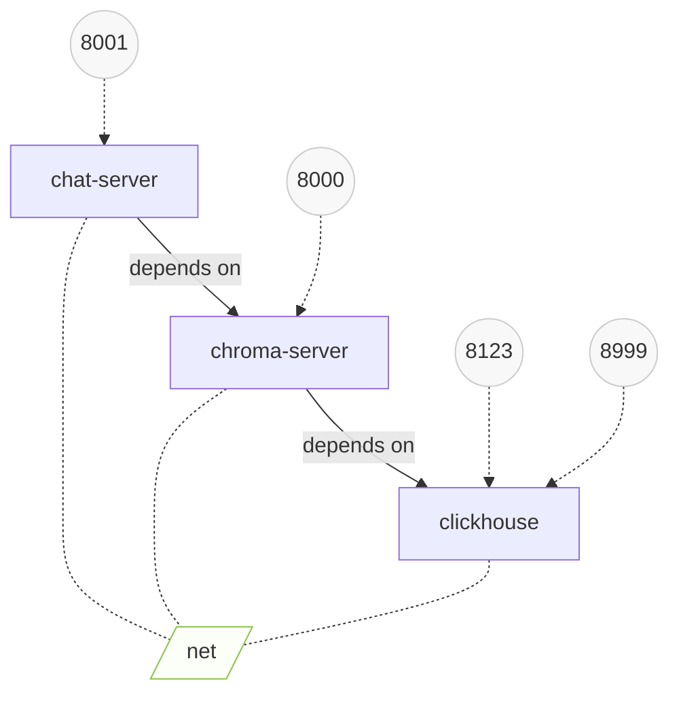

# kg-llm-interface
Langchain-powered natural language interface to RDF knowledge-graphs.

## Installation

This repository uses poetry for package management. A Makefile rule is provided to install the dependencies:

```bash
make install
```

## Pipelines

### Chroma build

Build the chromaDB index from input RDF files.

Location: [chroma_build.py](aikg/flows/chroma_build.py):

CLI usage: `python aikg/flows/chroma_build.py location.yml`
  + See [aikg.config.chroma.Location](aikg/config/chroma.py) for the schema of `location.yml`


## Chat server

The chat server can be started by running:

`uvicorn aikg.server:app`

## Containerized service

:warning: WIP, not functional yet

All services can be deployed together using `docker-compose`. The compose setup is as follows:


> figure generated with [docker-compose-viz-mermaid](https://github.com/derlin/docker-compose-viz-mermaid)

```sh
docker-compose up --profile db,frontend
```

If an external instance of ChromaDB is already running, set the correct values for CHROMA_HOST and CHROMA_PORT in `.env`, then run:

```sh
docker-compose up --profile frontend
```
