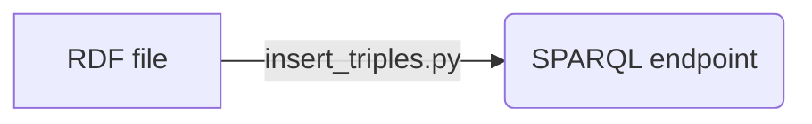
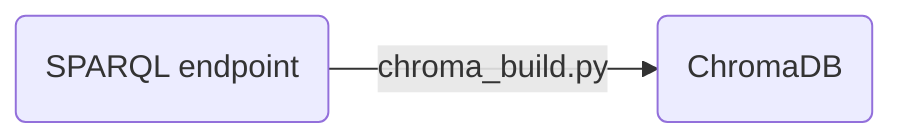
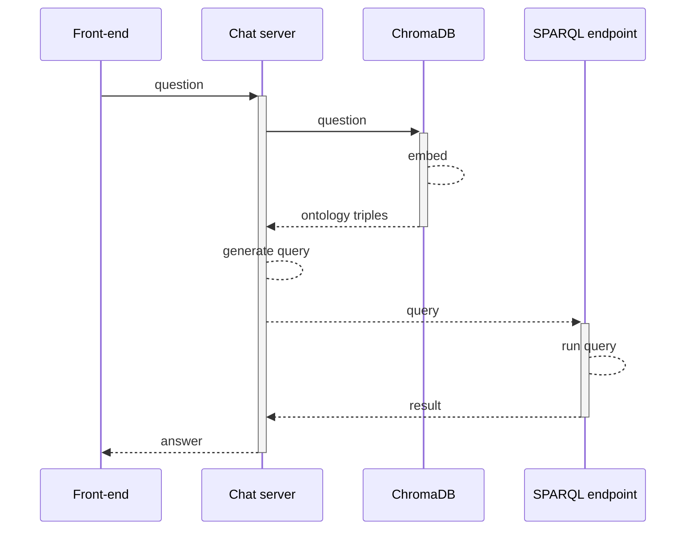

# kg-llm-interface
Langchain-powered natural language interface to RDF knowledge-graphs.

## Installation

This repository uses poetry for package management. A Makefile rule is provided to install the dependencies:

```bash
make install
```

## Configuration

Configuration variables are loaded from the `.env` file or environment variables. A template configuration file is provided in `.env.example`.

The chat configuration (`config.chat.ChatConfig`) uses OpenAI by default, however you can run this tool with open source LLMs using a framework such as llamafile, openllm or localGPT. When doing so, simply provide your LLM server url using `openai_api_base` and the model name using`model`.


## Quickstart

You can read and run the [example notebook](aikg/notebooks/nl_sparql.ipynb) to get a quick overview of the system.
The notebook supports using the Openai API and can run locally on a laptop.

To run the notebook in a containerized environment, run:

`make notebook`

## Server

The server can be deployed as a standalone service using the script `scripts/standalone_server.sh`. It will start a uvicorn server on port 8001, use chromaDB in client-only mode and use an RDF file as knowledge graph. This should work for small datasets.


## Pipelines

Pipelines are used to execute one-time operations for preparing data before the chat server can operate. They load their configuration from the `.env` file as well, but the variables can be overriden using yaml files (run with `--help` for more info).

### Insert triples



Insert data from an input RDF file to a SPARQL endpoint. The input file can be in any format supported by rdflib (ttl, json-ld, rdf/xlm, ...).

Location: [insert_triples.py](aikg/flows/insert_triples.py):

SPARQL configuration can be overriden by providing a yaml file following the [aikg.config.sparql.SparqlConfig](aikg/config/sparql.py) schema:

`python insert_triples --sparql-config-path sparql.yaml`

```yaml
# sparql.yaml
endpoint: http://localhost:3030/ds/query
user: admin
password: admin
```

CLI usage: `python aikg/flows/insert_triples.py`

### Chroma build



Build the chromaDB index from a SPARQL endpoint.

Location: [chroma_build.py](aikg/flows/chroma_build.py):

CLI usage: `python aikg/flows/chroma_build.py`

Chroma and SPARQL configurations can be overriden by providing a yaml file following the [aikg.config.chroma.ChromaConfig](aikg/config/chroma.py) or [aikg.config.sparql.SparqlConfig](aikg/config/sparql.py) schemas respectively.


## Containerized service

:warning: WIP, not functional yet

The chat server can be deployed along with the front-end, SPARQL endpoint and chromaDB server using kubernetes.



## Contributing

All contributions are welcome. New functions and classes should have associated docstrings following the [numpy style guide](https://numpydoc.readthedocs.io/en/latest/format.html).

The code formatting standard we use is [black](https://github.com/psf/black), with `--line-length=79` to follow [PEP8](https://peps.python.org/pep-0008/) recommendations. We use [pytest](https://docs.pytest.org/en/7.2.x/) as our testing framework. This project uses [pyproject.toml](https://pip.pypa.io/en/stable/reference/build-system/pyproject-toml/) to define package information, requirements and tooling configuration.

Tests can be executed with `make test`. Tests use [testcontainers](https://testcontainers.com) to temporarily deploy the required services.
